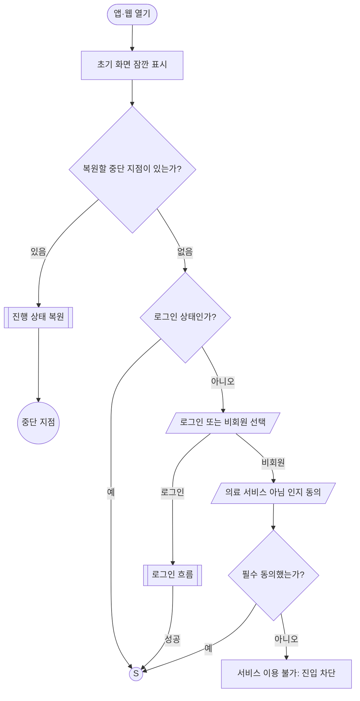
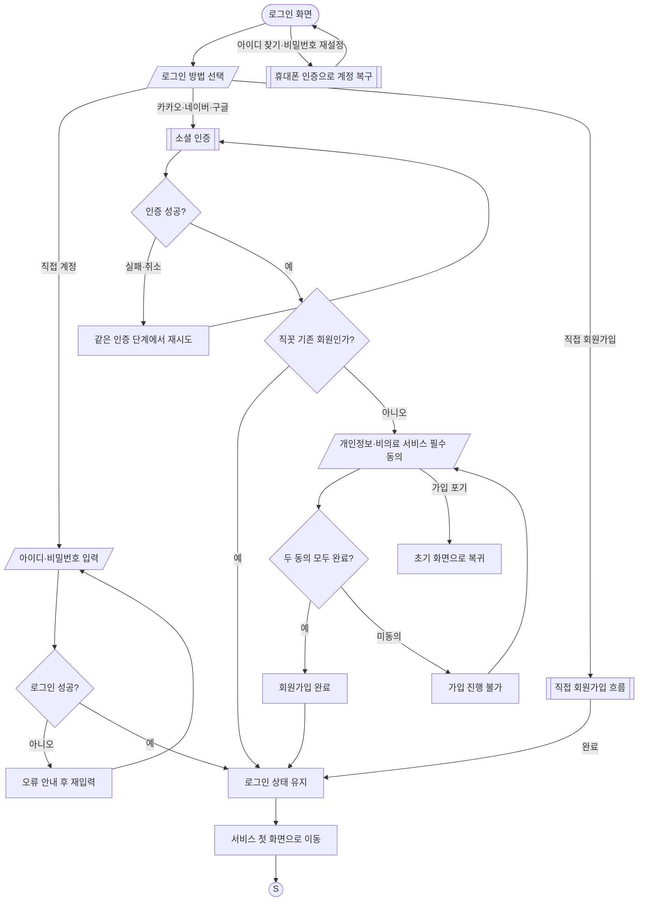
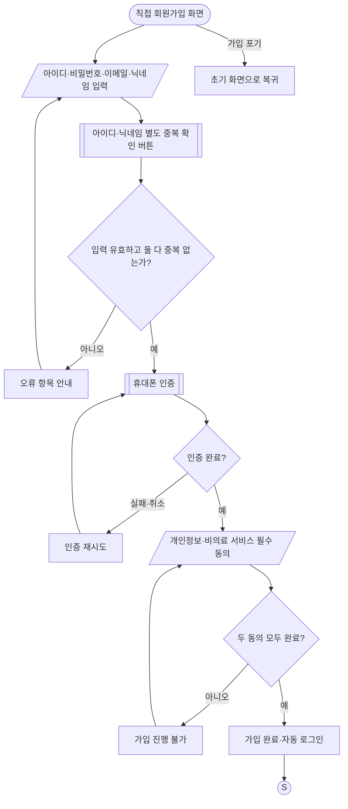
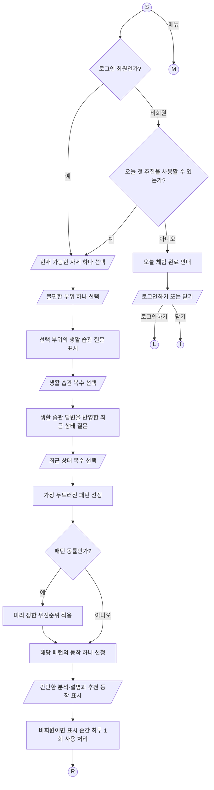
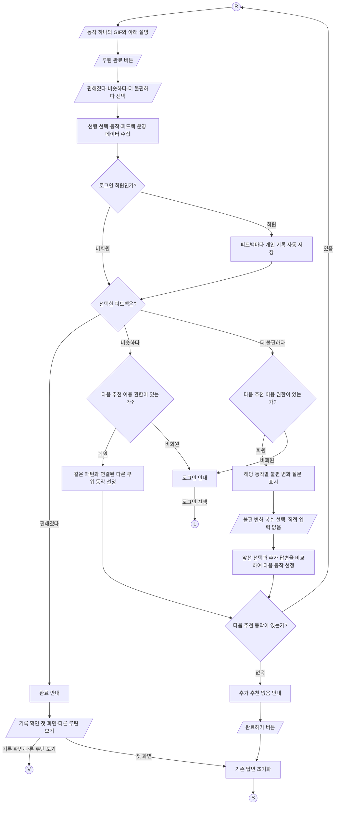
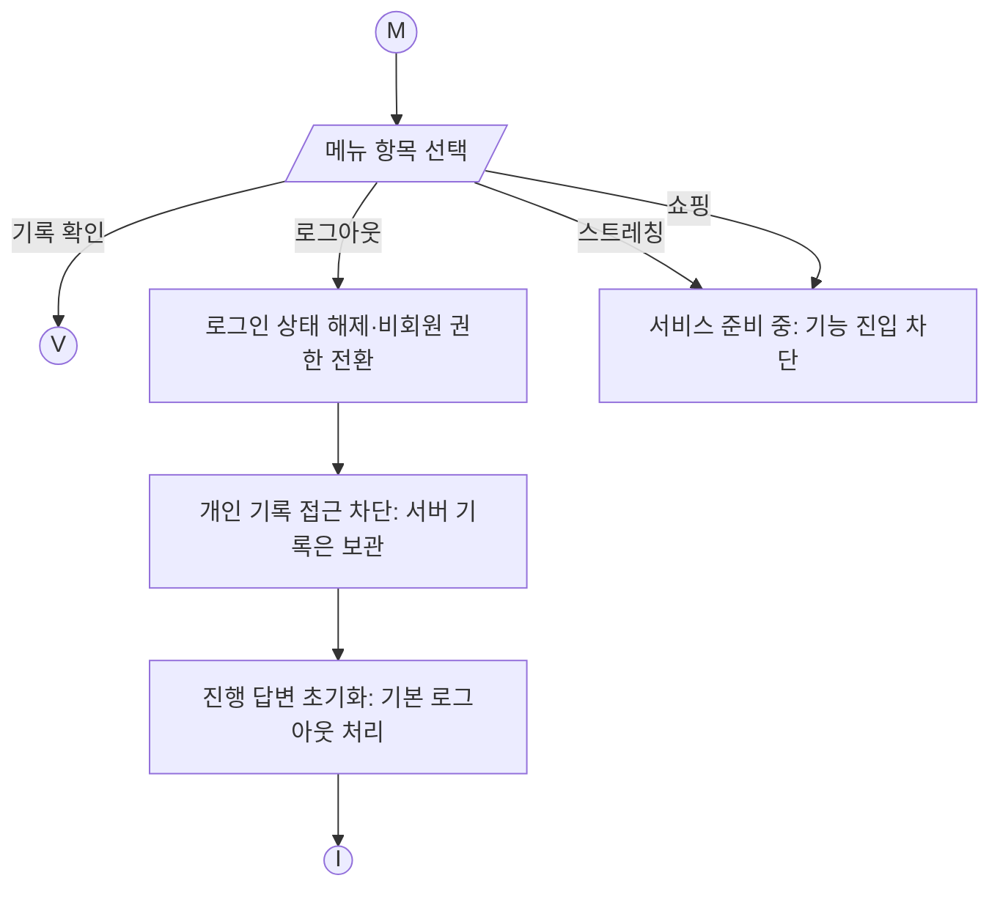
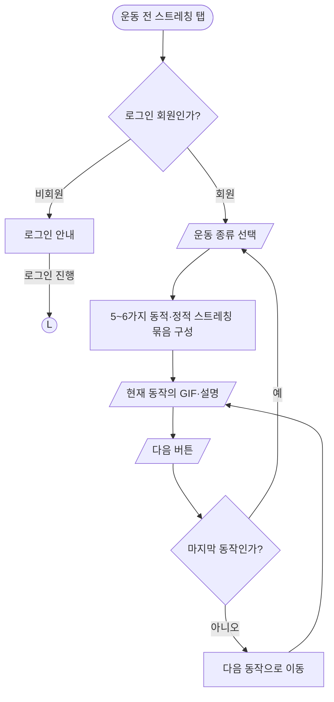
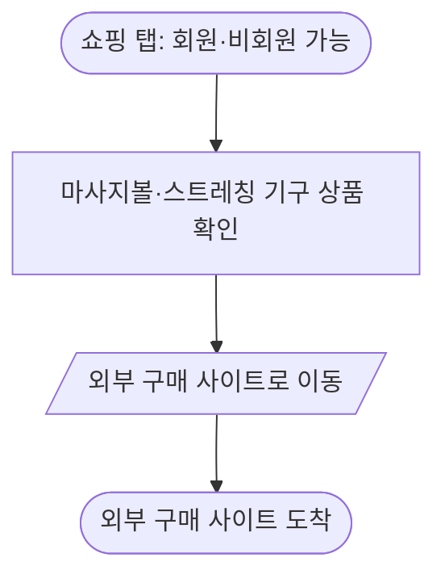
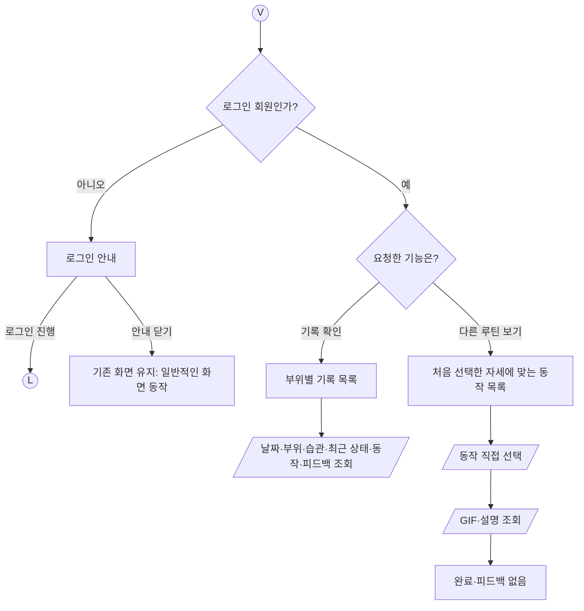
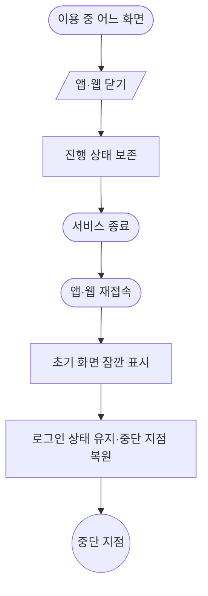

# 직꼿 전체 서비스 플로우 구현 — Codex 작업 지시서

아래 내용을 Codex의 작업 지시로 사용한다. 이 파일 후반에 포함된 서비스 플로우 정리본도 반드시 끝까지 읽는다.

## 1. 목표와 작업 저장소

나는 개발 비전문가이며 직꼿 서비스의 기획자다. 계획만 설명하지 말고 실제 코드를 수정하고 실행·검증하여 구현하라. 설명은 한국어로, 필요한 설정 작업은 비전문가가 따라 할 수 있게 작성하라.

- 참고할 프로토타입: https://github.com/ehdgus554/jikkot-ver9
- 실제 수정할 프로젝트: https://github.com/ehdgus554/jikkot
- `jikkot-ver9`의 기존 MVP를 기반으로 새 서비스 플로우를 구현하고, 최종 코드는 `jikkot`에 반영한다.
- Firebase로 인증·데이터 저장·서버 업무를 구축하고 Cloudflare에 프론트엔드를 배포한다. 새 도메인은 추후 Cloudflare에서 구입하여 연결한다.
- 기존 루틴 콘텐츠와 추천 메커니즘을 이번 구현의 프로토타입 기준으로 사용한다. 새로운 의학적 추천 논리를 만들지 않는다.
- 이번 출시에서 회원 기능도 모두 무료다. 결제·구독·평생회원 판매·관리자 화면은 만들지 않는다.

`덮어씌우기`는 `jikkot`의 앱 내용을 새 구현으로 교체한다는 의미다. 저장소를 삭제하거나 Git 이력을 초기화하거나 main에 force push하라는 뜻이 아니다. `jikkot-ver9`는 읽기 전용 참고 자료로 유지한다.

## 2. 먼저 조사하고 이어서 구현하라

1. 현재 작업 저장소의 remote, 브랜치, 미커밋 변경, AGENTS.md, 실행 환경을 확인한다. `jikkot`이 아닌 경우 대상 저장소를 별도 체크아웃한다. 기존 사용자 변경은 보존한다.
2. 두 저장소의 최신 기본 브랜치와 커밋을 확인하고 비교한다. 아래 사전 조사 결과를 그대로 믿지 말고 현재 코드로 다시 확인한다.
3. 대상 저장소의 현재 커밋을 복원 지점으로 기록하고 `feat/service-flow-firebase` 작업 브랜치를 만든다. 기존 클라우드 자원·실데이터는 삭제하지 않는다.
4. 첨부 플로우의 각 요구사항을 코드·검증 항목으로 연결한 체크리스트를 만든다. 현재 구현 / 이번에 구현 / 콘텐츠 또는 외부 설정 대기를 구분한다.
5. 합리적인 일반 구현 선택은 스스로 진행한다. 외부 키가 없는 기능도 인터페이스·서버 코드·에뮬레이터 검증·설정 문서를 완성한다. 한 기능의 키가 없다는 이유로 나머지 구현을 멈추지 않는다.
6. 구현·검증을 완료하고 변경사항과 잔여 외부 설정을 정리한다. GitHub에 쓸 권한이 있다면 작업 브랜치를 push하고 `jikkot` 대상으로 PR을 만든다. main 병합과 운영 배포는 준비된 결과를 검토할 수 있도록 별도 단계로 둔다.

### 2026-10-07 사전 코드 조사 결과

- `jikkot-ver9` 기준 커밋: `aca2be21aabc03d952128ccb1bebb228613d91d5`.
- `jikkot` 기준 커밋: `caf1a37685452576c40e087f02a397e4babcb835`.
- 당시 두 저장소의 앱·추천 데이터는 동일했다. 차이는 package.json, package-lock.json, tests/ui-components.test.mjs, wrangler.jsonc였다. 단순 복사로 대상의 배포 설정을 지우지 않는다.
- React 19 / TypeScript / Next.js App Router 형태 / Vite·vinext / Tailwind / Cloudflare Worker 구성이 있다.
- 주 UI: `app/jikkot-app.tsx`. 현재 문진 순서는 움직임 → 부위 → 최근 행동 → 생활습관이다.
- 데이터: `app/jikkot-data.ts`. 부위 5종, 생활습관·최근 행동 선택지, 태그별 routes, MV001~MV030 동작이 있다.
- `makeRecommendation`은 최근 행동 태그로 첫 매칭 route를 선택하고, 습관 태그 매칭과 기존 배열 순서로 후보를 정렬하며 자세를 필터링한다. 현재 긴장 완화 / 움직임 회복 / 근육 조절의 동작 3개를 반환한다. 후보가 부족하면 다른 동작으로 fallback한다.
- `allowedPositions`: seated는 앉기, standing은 앉기+서기, lying은 앉기+서기+눕기를 허용하는 누적 구조다.
- 현재 RA99/HB99 ‘해당 없음 / 잘 모르겠어요’ 선택지와 최대 2개 선택 제한이 있다.
- 기존 로그인은 아이디·비밀번호를 받고 `lib/server-auth.ts`, `db/schema.ts`, `app/api/auth/*`에서 D1 기반 회원·세션을 처리한다.
- 기존 비회원 한도는 `app/api/access/open/route.ts`에서 동작 상세를 열 때 처리한다. 로그인 후 pendingRoutine으로 돌아가는 코드도 있다.
- 미디어는 WebP와 SVG 경로를 사용한다. 파일 형식만 보고 움직이는 GIF가 있다고 가정하지 않는다.
- `npm run deploy`는 D1 원격 migration을 먼저 실행한다. Firebase 전환 후 이 명령이 남아 기존 DB에 쓰지 않도록 수정한다.
- Worker 이미지 코드의 IMAGES 의존성과 실제 wrangler binding도 확인한다. 배포 환경에서 이미지가 작동하는지 검증한다.

## 3. 명세 충돌과 콘텐츠 처리 원칙

우선순위는 이 지시서의 현재 사용자 요구 → 첨부 서비스 플로우의 확정 흐름·권한 → 기존 MVP다.

‘기존 메커니즘 유지’는 기존 질문·태그·routes·동작·우선순위를 활용한다는 뜻이다. 새 플로우와 다른 UI 순서, 3개 묶음 추천, 회원 권한, 로그인 후 진행 승계까지 유지하라는 뜻은 아니다.

- 문진 순서를 자세 → 부위 → 생활 습관 → 최근 상태로 바꾼다.
- 기존 5개 부위와 질문을 MVP 임시 콘텐츠로 재사용한다. 새 부위·질문·동작·의학적 해석을 임의로 추가하지 않는다.
- RA99/HB99를 화면에서 제거한다. ‘해당 없음’, ‘잘 모르겠음’, 직접 입력란을 제공하지 않는다. 최대 2개 제한은 제거하고 복수 선택을 허용한다. 미선택은 안내한다.
- 추천 함수와 콘텐츠를 UI에서 분리한다. 기존 태그 매칭·습관 가중·후보 우선순위가 유지됨을 대표 입력의 회귀 테스트로 증명한다.
- 기존 알고리즘이 반환한 후보 순서를 어댑터로 이용하여 한 번에 동작 하나를 보여준다. ‘첫 추천’은 기존 3슬롯을 합친 순서의 첫 적합 후보를 쓰는 MVP 기본값으로 구현·문서화한다. 이것을 새로 검증된 패턴 점수 모델로 포장하지 않는다.
- 기존 routes 배열의 매칭 순서를 임시 패턴 우선순위로 사용한다. 최종 패턴 점수·연결표는 콘텐츠 교체 지점으로 분리한다.
- 자세의 화면 문구는 정확히 ‘앉아서만 할 수 있음’, ‘서서 할 수 있음’, ‘누워서 할 수 있음’으로 바꾼다. 누적 자세 허용은 기존 MVP 기준으로 유지하되 그 의미를 문서화한다. 누워서만 수행한다는 의미로 임의 변경하지 않는다.
- 최근 상태를 습관 답변에 따라 달리 보여주는 연결표는 기존 MVP에 없다. 기존 태그의 단순 일치만으로 새 의미 관계를 발명하지 않는다. 조건부 질문 인터페이스와 설정 구조를 구현하고, 임시 MVP에서는 기존 부위별 질문을 사용한다. 조건별 차등 질문은 미완성 콘텐츠로 명시한다.
- ‘비슷하다’의 다른 부위 연결표, ‘더 불편하다’의 동작별 변화 질문·재추천표는 기존 코드에 없다. 데이터 주입으로 작동하는 분기·렌더러·서버 저장을 구현하고 테스트 전용 fixture로 분기를 검증한다. 운영 콘텐츠에는 가짜 연결을 넣지 않는다. 실제 연결표가 없으면 확정된 ‘추가 추천 없음 → 완료하기’ 경로로 연결한다. 같은 부위 후보를 다른 부위라고 표시하지 않는다.
- 기존 fallback 중 부위·패턴과 무관한 추천은 그대로 노출하지 않는다. 자세별 적합 후보를 사전 검증하고 지원하지 않는 콘텐츠 조합을 배포 전 검사에서 발견한다. 런타임에 자세 재선택·대체 추천 화면을 임의로 만들지 않는다.
- GIF·애니메이션을 표시할 수 있는 미디어 컴포넌트를 구현한다. 현 파일은 그대로 유지하고 실제 GIF가 없으면 기존 이미지를 임시 사용했다고 기록한다. 정지 그림을 GIF라고 부르거나 동작 영상을 임의 생성하지 않는다.

기술 구현 완료와 콘텐츠 확정 완료를 구분하라. 아직 없는 조건부 질문·재추천표·GIF 때문에 모든 최종 흐름이 실제 콘텐츠로 완성됐다고 보고하면 안 된다.

## 4. 반드시 구현할 현재 서비스

### 시작·동의·인증

- 초기 화면을 잠깐 표시한다. 인증 상태 확정을 기다린 뒤 같은 사용자에게 속한 유효한 진행 상태를 복원한다. 없으면 로그인 회원은 서비스 첫 화면, 그 외는 로그인/비회원 선택으로 연결한다.
- 비회원은 의료 서비스 아님 인지에 동의해야 진입한다. 거절하면 이용 차단한다.
- 아이디·비밀번호 로그인, 직접 회원가입, 구글·카카오·네이버 인증, 아이디 찾기·비밀번호 재설정 화면을 구현한다.
- 직접 가입 입력은 아이디·비밀번호·이메일·닉네임이며 아이디와 닉네임 각각 중복 확인 버튼을 제공한다. 이메일을 사용자에게 로그인 수단으로 바꾸지 않는다.
- 휴대폰 인증 뒤 개인정보·비의료 서비스 필수 동의를 받아 가입·자동 로그인한다. 최종 가입 때 중복과 인증·동의를 서버가 재검증한다. 중복 확인 후 입력을 바꾸면 확인 완료 상태를 해제한다.
- 소셜 신규 사용자는 두 동의를 완료한 뒤 서비스 회원으로 활성화한다. 인증 성공만으로 동의하지 않은 사용자를 서비스에 진입시키지 않는다. 가입 포기는 초기 화면으로 이동한다.
- 인증 실패·취소는 해당 단계에서 재시도한다. 소셜 취소 시 자동 재팝업을 반복하지 않는다.
- 비회원이 어느 경로에서 로그인해도 기존 답변·추천·pending 상태를 초기화하고 서비스 첫 화면으로 간다. 기록/목록/다음 추천으로 자동 복귀하지 않는다. 비회원 운영 데이터는 회원 기록에 복사하지 않는다.
- 로그아웃은 진행 상태와 개인 데이터의 로컬 캐시를 지우고 초기 화면으로 돌아간다. 회원 서버 기록은 유지한다. 다시 로그인하면 해당 계정의 기록이 보인다.

### 문진·추천·비회원 한도

- 첫 화면 메뉴: 기록 확인, 로그아웃, 스트레칭, 쇼핑. 비회원에게 회원 기능도 보이되 클릭하면 로그인 안내한다. 비회원의 로그아웃 항목은 숨기거나 비활성화하는 일반 UI 처리를 한다.
- 비회원 한도는 문진 진입 전에 서버로 확인한다. 한국 시간 Asia/Seoul 날짜 기준 하루 첫 추천 1회이며 로그인 회원은 무제한이다.
- 한도 초과는 ‘오늘 체험 완료’, ‘로그인하기 / 닫기’다. 닫기는 초기 화면으로 간다.
- 자세·부위 각각 하나, 생활습관·최근 상태는 복수 선택한다. 좌우 구분은 없다.
- 간단한 분석 설명 뒤 추천 동작 하나를 표시한다. 비회원은 추천 표시 시 한도를 소비한다. 조회·문진만으로 소비하지 않는다.
- 한도 확인만 통과한 여러 탭이 동시에 추천을 받지 않도록 서버 트랜잭션과 추천 식별자를 사용한다. 최초 표시와 서버 기록의 통신 실패는 같은 추천 ID로 재시도·복원하여 이중 소비하지 않는다. DOM 표시와 서버 처리를 완전히 원자적으로 할 수 없는 점은 구현 문서에 설명한다.
- 쿠키/익명 식별자 삭제·다른 브라우저까지 같은 사람으로 인식한다고 보장하지 않는다. 초기 구현은 브라우저 단위이며 회원 UID와 분리한다.
- 추천 화면은 미디어와 아래 설명, ‘루틴 완료’ 버튼이다. 타이머와 다음 동작 버튼은 없다.

### 피드백·기록·목록

- 루틴 완료 뒤 ‘편해졌다 / 비슷하다 / 더 불편하다’ 중 하나를 선택한다.
- 비회원도 피드백을 제출하며 문진·추천·피드백 운영 데이터를 저장한다. 개인 기록 저장·조회는 제공하지 않는다.
- 회원은 매번 피드백 제출 시 자신의 기록을 자동 저장한다. 전체 세션 종료를 기다리지 않는다.
- 편해졌다: 완료 안내와 기록 확인 / 첫 화면 / 다른 루틴 보기. 첫 화면은 답변 초기화, 다른 루틴 보기는 자세에 맞는 동작 목록 조회다.
- 비슷하다: 회원은 같은 패턴에 연결된 다른 부위 동작의 다음 추천 경로로, 비회원은 로그인 안내로 연결한다.
- 더 불편하다: 회원은 동작별 불편 변화 복수 선택 질문 뒤 다음 추천 경로로, 비회원은 질문 전 로그인 안내로 연결한다. 직접 입력란은 없다. 실제 질문·연결 콘텐츠가 없을 때 처리는 3절을 따른다.
- 다음 추천이 없으면 추가 추천 없음 안내와 완료하기 → 답변 초기화 → 서비스 첫 화면이다.
- 회원 전용 기능의 로그인 안내를 닫으면 기존 화면을 유지한다.
- 기록은 부위별로 묶고 날짜·부위·습관·최근 상태·동작·피드백을 보여준다. 추가 변화 답변이 있으면 함께 저장한다. 과거 콘텐츠 변경에도 당시 선택 내용이 보이도록 ID와 표시 문구/콘텐츠 버전을 함께 저장한다.
- 동작 목록은 처음 선택한 자세에 맞게 필터링한다. 직접 고른 동작은 미디어·설명 조회만 제공하고 완료·피드백·개인 수행 기록을 만들지 않는다.
- 스트레칭·쇼핑은 현재 ‘서비스 준비 중’으로 막는다. 안내를 닫으면 기존 화면을 유지한다. 출시 후 운동 전 스트레칭·상품·외부 구매 흐름은 이번에 활성화하지 않는다. 기본 false feature flag로 경계를 둔다.

### 중단·복원·오류

- 단계 전환·입력 변경 때 상태를 저장한다. 종료 이벤트에만 의존하지 않는다. 문진·추천·피드백·기록·목록 조회의 위치를 재접속 시 복원한다.
- 상태에는 schemaVersion, 소유자 종류와 식별자, 화면, 답변, 추천 ID, 현재 동작, 제출 상태, 콘텐츠 버전을 둔다. 인증 토큰·비밀번호·SMS 코드는 앱 진행 상태에 저장하지 않는다.
- 로그인 유지와 화면 복원은 별도다. 회원 A의 상태를 회원 B나 비회원에게 복원하지 않는다. 만료·삭제·구버전 상태는 검증 후 안전하게 첫 화면으로 돌아간다.
- 비회원도 같은 추천을 복원할 수 있으며 날짜가 바뀌어도 복원 자체는 새 체험 소비가 아니다. 완료된 체험을 복원하는 것과 새 추천 시작을 구분한다.
- 피드백 저장은 고정된 제출 식별자로 중복을 방지한다. 저장 실패 시 입력을 유지하고 재시도한다. 저장 성공 전에 성공 화면을 확정하지 않는다.
- 로컬 상태 복원은 같은 브라우저 기준으로 구현한다. 다른 기기까지 이어하기 기능은 임의 추가하지 않는다.

## 5. Firebase 백엔드

Firebase Authentication + Cloud Firestore + 필요한 Cloud Functions를 기본 구조로 사용한다. 프론트엔드는 Cloudflare의 기존 vinext/Worker 구조를 우선 유지한다. Firebase Admin SDK와 비밀키를 브라우저에 넣지 않는다. Node 서버 전용 업무는 Firebase Functions에서 수행하여 Worker 호환성 문제를 피한다.

### 인증 설계

- Firebase의 이메일/비밀번호 기본 UI를 이유로 아이디 로그인을 이메일 로그인으로 바꾸지 않는다.
- 아이디 로그인은 서버의 비공개 아이디→인증 계정 매핑과 Firebase 인증의 비밀번호 검증을 조합하거나, 검증된 커스텀 인증으로 구현한다. 방법을 비교한 뒤 하나를 선택하고 보안·복구 경로를 문서화한다. 비밀번호 검증에 근거하지 않은 custom token 발급은 금지한다. Firebase가 비밀번호를 관리하는 구성을 우선한다.
- 아이디·닉네임 유일성은 서버의 원자적 예약/확정으로 보장한다. Authentication과 Firestore에 걸친 가입 실패 시 부분 계정·예약을 정리하는 재시도/보상 처리를 설계한다.
- 구글은 Firebase 인증, 카카오·네이버는 공식 지원 방법을 확인하여 서버에서 공급자 토큰을 검증한 뒤 Firebase 계정으로 연결한다. 사용자가 보낸 provider ID를 그대로 신뢰하지 않는다. callback/state 검증·모바일 redirect·중복 계정 처리를 구현한다.
- 전화번호 확인은 Firebase SMS 방식으로 우선 구현하되 이를 법적 본인확인 인증으로 표현하지 않는다. 전화 인증이 임시 인증 계정을 만들면 가입 계정으로 안전하게 연결·정리한다.
- 아이디 찾기·비밀번호 재설정은 인증된 전화번호가 실제 연결된 계정에만 적용한다. 전화번호 입력만으로 계정을 공개하거나 비밀번호를 바꾸지 않는다. 이메일 reset만으로 휴대폰 복구를 구현했다고 보고하지 않는다.
- 계정 연결은 이미 인증한 계정의 소유 증명에 근거한다. 이메일 문자열이 같다는 이유로 직접 계정과 소셜 계정을 자동 병합하지 않는다.
- 소셜 키/SMS/프로젝트 설정이 없으면 개발 에뮬레이터·공식 테스트 번호로 검증하고 운영 미연결 상태를 명시한다. 테스트 인증 우회가 운영 빌드에 포함되지 않도록 검사한다.

### 데이터·권한

컬렉션 이름은 설계에 맞게 정하되 최소한 다음 책임을 분리한다.

- 회원 프로필: UID, 아이디, 닉네임, 이메일, 검증된 전화번호 참조, 가입 활성화 상태, 동의 버전과 시각.
- 비공개 아이디·닉네임 예약/조회 매핑: 서버 전용.
- 회원 피드백 기록: UID 소유권, 문진·추천·패턴·동작 스냅샷, 피드백, 시각, 제출 ID.
- 운영 이벤트: 회원/비회원 종류, 날짜·자세·부위·습관·최근 상태·동작·피드백. 비회원 이벤트를 이후 회원 UID의 개인 기록으로 연결하지 않는다.
- 비회원 일일 사용: 서버가 확인한 익명 식별자, KST 날짜, 체험 ID, 첫 추천, 소비 상태.

Firestore rules·indexes·Firebase 설정·Functions 소스·환경변수 예시를 저장소에 포함한다. 회원 본인만 본인의 기록을 조회하고 다른 회원 기록은 읽을 수 없게 한다. 익명 Firebase 사용자가 있다면 request.auth 존재만으로 회원이라고 처리하지 않는다. 활성화된 회원 조건을 검증한다. 운영 데이터·유일성 매핑·일일 사용 카운터는 클라이언트 임의 수정과 공개 조회를 막는다.

Functions의 Admin SDK는 rules를 우회하므로 매 요청의 인증·계정 상태·입력·소유권을 직접 검증한다. 회원/비회원 판정, 한도, 날짜, 추천 ID를 클라이언트 값만으로 신뢰하지 않는다. 추천 ID·선택지·피드백 값은 서버 콘텐츠와 대조한다. 인증/계정복구에 요청 제한을 두고 비밀번호·인증코드·전체 토큰을 로그에 남기지 않는다.

Firebase Emulator Suite로 실데이터와 분리해 테스트한다. 운영 수집 항목·보관기간·동의 문구는 아직 미확정이므로 설정으로 분리하고 최종 문안이라고 주장하지 않는다. 비회원 추가 필수 개인정보 동의 화면을 임의로 넣지 않는다. 운영 데이터 수집의 출시 전 검토 항목은 별도 문서화한다.

기존 D1 연동을 새 앱의 운영 의존성에서 제거하고 deploy 스크립트·bindings·문서를 갱신한다. 기존 DB 삭제나 기존 회원 이전은 자동 수행하지 않는다. 실사용 계정이 있으면 이전 여부·인증 호환·재설정 필요 여부를 별도 제시한다.

## 6. Cloudflare 배포·새 도메인

- 현재 Worker/vinext 구성을 실제 빌드·로컬 Worker 미리보기로 검증한다. 필요 없는 프레임워크 전면 교체는 하지 않는다. Firebase는 데이터/서버, Cloudflare는 웹 제공 역할을 맡는다.
- `jikkot`에 연결할 배포 설정과 GitHub 변경 시 재배포 방법을 마련한다. main 이외 검토용 배포가 운영 자원을 덮어쓰지 않도록 분리한다.
- 개발/미리보기/운영 Firebase 프로젝트와 환경변수를 구분한다. 비밀은 Secret Manager·플랫폼 secret 설정에 두고 .env.example은 이름·설명·샘플 값만 포함한다.
- Firebase Auth 허용 도메인, 구글·카카오·네이버 callback URL, Functions CORS/허용 출처, API URL을 새 도메인에 맞춰 설정하는 절차를 작성한다.
- 먼저 임시 Cloudflare 주소에서 검증할 수 있도록 준비한다. 도메인 이름이 정해지지 않았으므로 도메인을 임의 구매하지 않는다. 구매·결제 정보는 사용자가 처리해야 하는 마지막 외부 설정으로 남긴다.
- 새 도메인 구입 → Cloudflare DNS → Worker Custom Domain 연결 → HTTPS → 인증 callback/허용 도메인 갱신 → 로그인·기록·미디어 점검 순서를 안내한다.
- Firebase Functions 배포에 필요한 요금제·SMS 요금 등은 최신 공식 문서로 확인하여 설정 문서에 안내한다. 서비스 내 결제 기능과 클라우드 운영비는 구분한다.
- 외부 계정 접근 권한이 없다면 코드·설정·에뮬레이터 검증·실행 명령을 먼저 완성한 뒤 사용자에게 필요한 최소 클릭 작업만 안내한다. 운영 배포를 실제 수행하지 않았다면 ‘배포 완료’라고 쓰지 않는다.

## 7. 검증과 산출물

구현 완료 후 빌드·타입 검사·린트 및 다음 핵심 시나리오를 테스트한다. 기존 테스트가 옛 흐름에 묶여 있으면 새 요구를 확인하도록 수정한다. 테스트를 통과시키려고 실패하는 검사를 무작정 제거하지 않는다.

1. 기존 추천의 대표 입력에서 태그·후보 우선순위 보존, 단일 동작 표시, 자세 적합성.
2. 생활습관 다음 최근 상태, RA99/HB99 제거, 복수 선택과 미선택 검증.
3. 비회원 동의 거절 차단, 문진 전 한도 확인, 추천 표시 소비, 한국 자정 경계, 다중 탭 경쟁.
4. 중단 추천 복원 시 재소비 없음, 새 체험과 기존 체험 구분.
5. 비회원 피드백 가능, 기록/목록/재추천 로그인 안내, 안내 닫기 유지.
6. 비회원 로그인 후 완전 초기화, guest 운영 기록의 회원 기록 미이전.
7. 회원 피드백마다 개인 기록 저장, 같은 제출 재시도 중복 없음, 서버 실패 후 재시도.
8. 부위별 기록 조회, 다른 UID 접근 거절, 로그아웃 후 개인 캐시·진행 삭제와 서버 기록 유지.
9. 조건부 질문·다른 부위 재추천·악화 질문 분기는 테스트 fixture로 검증하고 운영 미확정 콘텐츠는 분리.
10. 추가 추천 없음 완료 경로, 동작 목록 조회 시 완료·피드백 없음, 준비 중 두 탭.
11. 직접 가입 중복 경쟁/입력 변경, 동의 전 진입 차단, 전화번호 계정복구 소유권 검증.
12. 소셜 실패·취소·callback 검증, 계정 자동 오병합 방지, 인증별 운영 연결 상태 표시.
13. 인증 복원 후 사용자별 진행 복원, 새로고침·브라우저 재시작·계정 변경.
14. 모바일 360~390px와 데스크톱에서 한국어 줄바꿈·버튼·모달·미디어·키보드 조작 확인.
15. Cloudflare 실제 런타임에서 Firebase 클라이언트/Functions 통신·이미지·환경변수 확인. 외부 운영 설정이 없으면 로컬 검증 범위를 명시.

권장 산출물:

- 실제 작동하는 앱과 Firebase Functions 코드.
- Firebase rules, indexes, firebase.json, 환경변수 예시, Cloudflare 설정, 잠금파일과 재현 가능한 명령.
- `docs/service-flow.md`: 첨부 명세 보관.
- `docs/implementation-checklist.md`: 각 요구 → 코드/테스트/현재 상태.
- `docs/content-gaps.md`: 기존 MVP 임시 콘텐츠, 조건부 질문·재추천표·GIF 등의 부족분과 교체 위치.
- `docs/deployment-guide-ko.md`: Firebase·소셜·SMS·Cloudflare·도메인 설정 순서, 필요한 값, 검증, 롤백.
- README: 로컬 실행·에뮬레이터·테스트·배포 명령과 현재 구현 범위.
- `jikkot` 대상 작업 브랜치와 PR(권한이 있는 경우).

최종 보고에는 구현 완료, 검증한 항목, 콘텐츠 대기, 외부 설정 대기, PR/미리보기 링크를 구분하라. 설명만 제공하거나 가짜 로그인·로컬 가짜 기록으로 Firebase 구현을 대체하지 않는다. 하나의 외부 설정이 막혀도 나머지 작업을 완수한다.

## 8. 서비스 플로우 원문

다음 원문은 확정된 흐름의 기준이다. 위 지시서의 ‘기존 MVP 콘텐츠 재사용’은 원문의 콘텐츠 보류를 이번 프로토타입에서 임시로 처리하는 기준이며, 최종 추천 콘텐츠를 확정하는 지시가 아니다.

# 직꼿 서비스 플로우 차트 — 서비스 흐름 정리본

기준일: 2026-10-07. 본 문서는 이번 대화에서 확정된 화면 이동·이용 권한·피드백 분기·종료·재접속 흐름을 연결한 정리본이다. 구체적인 질문·추천 규칙·동작 콘텐츠를 확정한 문서가 아니다. 부위·생활 습관·최근 상태·패턴·추천 동작의 연결은 서비스 핵심 콘텐츠로서 별도 시간을 들여 설계하며, 현재 단계에서는 보류한다. 간단한 문답으로 연결 기준을 확정하거나 임의로 채우지 않는다.

## 1. 설계 기준

- 최종 서비스 전체를 대상으로 설계한다. 결제는 추후 도입하며 현재 회원 기능도 모두 무료다.
- 비회원은 하루 한 번 추천 동작을 체험하고 피드백을 제출한다. 기록 저장·조회, 다음 추천, 동작 목록 조회는 회원 전용이다.
- 비회원 하루 한도는 문진 전에 확인한다. 한도 도달 화면은 ‘오늘 체험 완료’와 ‘로그인하기 / 닫기’를 제공하며, ‘닫기’는 초기 화면으로 돌아간다.
- 로그인 회원의 추천 횟수에는 현재 제한을 두지 않는다.
- 회원 전용 기능은 비회원에게도 동일하게 표시하되, 사용하려고 하면 로그인을 안내한다.
- 비회원 이용 중 로그인하면 진행을 승계하지 않고 서비스 첫 화면에서 새로 시작한다.
- 비회원 체험 운영 데이터는 로그인 후 회원의 개인 기록으로 옮기지 않는다.
- 로그아웃하면 비회원 권한으로 전환된다. 회원 기록은 서버에 보관되지만 로그아웃 상태에서는 개인 기록을 조회할 수 없다. 해당 계정으로 다시 로그인하면 그 계정의 기록을 조회할 수 있다.
- 비회원이 의료 서비스가 아님 인지 동의를 거절하면 서비스 자체에 진입할 수 없다.
- 앱·웹을 닫으면 종료한다. 재접속하면 로그인 상태를 유지하고 중단 지점을 복원한다. 명시적으로 ‘첫 화면 돌아가기’를 선택한 경우에는 입력 답변을 초기화한다.
- 현재 가능한 자세와 불편한 부위는 각각 하나만 선택한다. 부위의 좌우 구분은 없다.
- 현재 가능한 자세의 선택지는 ‘앉아서만 할 수 있음’, ‘서서 할 수 있음’, ‘누워서 할 수 있음’ 세 가지로 확정한다.
- 생활 습관과 최근 상태는 복수 선택이다. ‘해당 없음’과 ‘잘 모르겠음’, 직접 입력란은 두지 않는다.
- 생활 습관 질문은 선택한 불편 부위별로 같은 질문 묶음을 제공한다. 최근 상태 질문은 앞선 생활 습관 답변을 반영하여 달라진다.
- 가장 두드러진 패턴에 맞는 동작 하나를 추천한다. 동률이면 미리 정한 우선순위를 적용한다.
- 선택한 자세로 수행할 수 없는 추천 조합은 설계에서 제외한다. 해당 상황의 대체 추천·자세 재선택 분기는 만들지 않는다. 구체적인 제외·연결 규칙은 콘텐츠 설계에서 마련한다.
- 통증 추천의 루틴 하나는 동작 하나다. GIF와 아래 설명으로 제공하며 타이머와 다음 동작 버튼은 없다. 출시 후 운동 전 스트레칭의 여러 동작 묶음은 별도 방식으로 구성한다.
- 비회원도 중단한 체험을 이어서 볼 수 있으며, 같은 추천 동작을 복원하는 것은 추가 추천 사용으로 세지 않는다.
- 서비스 첫 화면의 메뉴는 기록 확인, 로그아웃, 스트레칭, 쇼핑으로 구성한다. 현재 스트레칭·쇼핑은 탭만 제공하며 두 기능의 이용은 막고 ‘서비스 준비 중’ 안내를 표시한다.
- 출시 후 운동 전 스트레칭은 회원 전용이다. 운동 종류만 선택하면 5~6가지 동적·정적 스트레칭을 조합한 묶음을 제공하며, 각 동작은 GIF·설명으로 표시하고 ‘다음’ 버튼으로 진행한다.
- 운동 전 스트레칭은 조회 기능만 제공하며 개인 완료 기록·피드백을 받지 않는다. 마지막 동작을 마치면 운동 종류 선택 화면으로 돌아간다.
- 출시 후 쇼핑은 비회원도 가능하다. 마사지볼·스트레칭 기구 등 상품을 확인한 뒤 외부 구매 사이트로 이동한다.

## 2. 기호와 연결점

| 표현 | 의미 |
|---|---|
| 둥근 시작·끝 도형 | 시작 또는 종료 |
| 직사각형 | 화면 표시·시스템 처리 |
| 마름모 | 조건 판단 |
| 평행사변형 | 사용자 입력·선택 또는 결과 출력 |
| 양옆에 선이 있는 직사각형 | 다른 차트에서 상세히 설명하는 하위 흐름 |
| 원형 연결점 | 다른 차트의 같은 이름 연결점으로 이동 |
| ‘미정’ 표기 | 확인이 필요한 분기 또는 콘텐츠 |

| 연결점 | 목적지 |
|---|---|
| S | 서비스 첫 화면. 문진 전 이용 한도 확인, 가능한 자세 선택, 메뉴 접근 |
| R | 추천 동작의 GIF·설명 화면 |
| L | 로그인 흐름. 비회원 전환 로그인 성공 후에는 답변 초기화 후 S |
| V | 회원 전용 기록·동작 목록 조회 흐름 |
| M | 서비스 메뉴. 기록 확인·로그아웃·스트레칭·쇼핑 |
| I | 초기 화면. 잠깐 표시한 뒤 로그인·비회원 선택으로 연결 |
| E | 앱·웹 닫기와 재접속 처리 |

## 3. 첫 진입·로그인·비회원 진입

중단 지점 복원은 선택·문진·추천·조회 등 진행 중이던 화면으로 연결한다. 복원 여부에 따라 로그인 상태가 해제되는 것은 아니다. 이미 완료한 흐름을 명시적으로 새로 시작하면 이전 답변은 초기화된다.

### 로그인 상세

비회원이 회원 전용 기능에서 로그인한 경우, 성공 후 기존 답변을 초기화하고 S로 이동한다. 요청했던 기록·목록·다음 추천으로 자동 복귀하지 않는다. 비회원 체험 운영 데이터는 회원 개인 기록으로 옮기지 않는다. 기존 회원은 서버에 보관된 자신의 과거 기록을 로그인 상태에서 조회할 수 있다.

### 직접 회원가입 상세

회원가입 입력·인증·약관의 내부 배치는 일반적인 서비스 흐름에 따른 기본 구성이다. 비밀번호·아이디 형식 등 세부 유효성 기준, 인증 사업자·수단, 소셜 계정과 직접 계정의 중복 연결 정책, 약관 문구는 미정이다. 이메일은 로그인 수단이 아닌 가입 정보다.

## 4. 서비스 첫 화면·문진·첫 추천

현재 가능한 자세는 아래 세 가지 중 하나를 선택한다.

| 선택지 | 선택 방식 |
|---|---|
| 앉아서만 할 수 있음 | 단일 선택 |
| 서서 할 수 있음 | 단일 선택 |
| 누워서 할 수 있음 | 단일 선택 |

아래 차트는 문진의 화면 순서와 추천 처리의 역할을 나타낸다. 실제 불편 부위 선택지, 질문, 패턴 판별 기준과 추천 동작의 연결은 추후 콘텐츠 설계에서 마련한다.

질문과 동작의 연결표는 수행 가능한 자세에 맞는 조합으로 구성한다. 자세 불일치에 대한 별도 실패 분기를 두지 않는다. 생활 습관·최근 상태는 항목 선택 후 다음 단계로 진행하며, 미선택 입력에 대한 안내는 일반적인 입력 검증으로 처리한다.

비회원 한도는 문진 전에 확인한다. 한도 도달 시 ‘오늘 체험 완료’와 ‘로그인하기 / 닫기’를 제공한다. ‘닫기’는 앱·웹을 닫는 것이 아니라 초기 화면으로 돌아가는 동작이다. 동일한 체험의 중단 지점 복원은 새 추천 사용으로 계산하지 않는다. 일일 한도를 판단하는 비회원 식별 방법과 날짜 변경 기준은 구현 단계에서 정해야 한다.

## 5. 동작 수행·피드백·다음 추천

‘다음 추천’은 피드백 기반 재추천이다. ‘다른 루틴 보기’는 동작 목록을 직접 조회하는 경로다. 목록 조회에는 루틴 완료와 피드백을 붙이지 않는다.

비회원도 회원과 같은 피드백·완료 화면을 본다. ‘편해졌다’ 완료 화면의 기록 확인·동작 목록 조회를 누르면 로그인 안내를 표시한다. ‘비슷하다’ 또는 ‘더 불편하다’로 다음 추천 경로에 진입하면 로그인 안내를 표시한다. 로그인 후에는 기존 진행을 승계하지 않고 서비스 첫 화면에서 새로 시작한다. 로그인 안내를 닫는 동작은 기존 화면을 유지하는 일반적인 화면 처리로 구성한다.

‘더 불편하다’ 응답에 대한 질문은 동작별로 준비한 선택지를 사용한다. 어떤 변화가 어느 다음 동작으로 연결되는지, 같은 동작을 다시 추천할 수 있는지 등 상세 연결 기준은 미정이다. 위 차트는 흐름을 나타내며, 신체 상태나 원인을 확정한 것이 아니다.

## 6. 서비스 메뉴·기록·동작 목록 조회

### 서비스 첫 화면의 메뉴

현재 두 탭은 ‘서비스 준비 중’ 안내까지만 연결하며, 아래 출시 후 흐름에는 진입시키지 않는다. 준비 중 안내를 닫으면 기존 화면을 유지하는 일반적인 화면 처리로 구성한다. 출시 후 스트레칭은 회원 전용이고 쇼핑은 비회원도 이용할 수 있다. 운동 전 스트레칭과 기존 추천 후 동작 목록 조회는 서로 다른 경로다. 로그아웃하면 비회원 권한으로 전환되어 개인 기록 접근이 차단된다. 서버의 회원 기록은 삭제하지 않는다. 진행 답변 초기화 후 초기 화면으로 돌아가는 것은 사용자가 허용한 일반적인 기본 화면 처리로 구성한다.

### 출시 후 계획: 운동 전 스트레칭

운동 전 스트레칭은 운동 종류만 선택하며 통증 추천 문진을 사용하지 않는다. GIF·설명을 순서대로 보는 기능만 제공하고 개인 완료 기록·피드백은 받지 않는다. 마지막 동작을 마치면 운동 종류 선택 화면으로 돌아간다. 차트에서는 기존 ‘다음’ 버튼을 마지막 동작의 종료에도 사용하는 기본 화면 구성을 적용한다. 운동 종류의 실제 선택지, 운동별 5~6가지 조합, 동작 순서는 콘텐츠로 마련한다. 타이머나 다른 제어 기능을 추가로 확정하지 않는다.

### 출시 후 계획: 쇼핑

상품 확인 화면의 내부 목록·상세 구성과 대상 상품·외부 구매 사이트는 콘텐츠·화면 설계에서 마련한다. 직꼿 안의 장바구니·주문·결제는 이번 확정 흐름에 포함하지 않는다.

### 기존 기록·추천 후 동작 목록 조회

기록 메뉴는 서비스 첫 화면과 ‘편해졌다’ 완료 화면에서 진입한다. 기록은 부위별로 묶으며, 날짜·선택 부위·습관·최근 상태·추천 동작·수행 후 피드백을 모두 제공한다. 목록의 정렬·상세 화면 배치와 조회 화면에서의 뒤로 가기는 일반적인 화면 흐름으로 구성한다.

## 7. 앱·웹 닫기·재접속

진행 상태 보존은 다음 접속 때 이어가기 위한 상태 관리다. 회원의 개인 수행 기록과 비회원 피드백 운영 데이터는 별도 목적의 데이터다. 회원 기록은 피드백 제출마다 이미 저장되므로, 전체 이용 종료를 기다리지 않는다. 비회원에게 개인 기록 저장·조회 기능은 제공하지 않는다.

일반적인 통신·저장·인증 오류에는 오류를 안내하고 현재 단계에서 재시도하도록 구성한다. 미제출 입력은 가능한 범위에서 유지한다. 피드백 저장 실패·중복 제출 시의 세부 표시와 저장 복구 규칙은 구현 명세에서 정한다.

## 8. 회원·비회원 권한과 수집 정보

| 기능 | 비회원 | 로그인 회원 |
|---|---|---|
| 첫 추천 | 하루 1회 | 횟수 제한 없음 |
| 동작 GIF·설명 | 추천된 동작 조회 | 추천된 동작 조회 |
| 루틴 완료·피드백 | 가능 | 가능 |
| 다음 추천 | 로그인 안내 | 가능 |
| 동작 목록 직접 조회 | 로그인 안내 | 가능 |
| 개인 기록 저장·조회 | 로그인 안내. 개인 기록 제공 없음 | 피드백마다 저장·부위별 조회 |
| 스트레칭 탭: 현재 | 서비스 준비 중 | 서비스 준비 중 |
| 쇼핑 탭: 현재 | 서비스 준비 중 | 서비스 준비 중 |
| 운동 전 스트레칭: 출시 후 | 로그인 안내 | 운동 종류 선택 후 5~6가지 순차 조회. 기록·피드백 없음 |
| 쇼핑: 출시 후 | 상품 확인·외부 구매 사이트 이동 | 상품 확인·외부 구매 사이트 이동 |
| 중단 지점 복원 | 가능 | 가능 |
| 의료 서비스 아님 인지 동의 | 진입 전 필수 | 가입 시 필수 |
| 개인정보 동의 | 현재 확정된 비회원 동의 항목에는 없음 | 가입 시 필수 |
| 결제 | 현재 없음 | 현재 없음 |

비회원 운영 데이터 항목: 날짜, 가능한 자세, 불편 부위, 생활 습관, 최근 상태, 추천 동작, 수행 후 피드백. 어떤 식별 정보와 결합하는지, 저장 범위·기간·동의 문구는 아직 정하지 않았다.

## 9. 남은 결정 사항

### 현재 범위와 보류 과제

주요 화면의 연결·권한·종료·재접속 흐름을 정리했다. 가능한 자세의 세 가지 선택지도 확정했다. 핵심 콘텐츠인 실제 불편 부위 선택지, 생활 습관·최근 상태 질문, 패턴 판별과 추천 동작 연결은 별도 설계 과제로 보류한다. 본 정리본의 추천 처리 상자는 역할만 정의하며 실행 가능한 추천 규칙을 의미하지 않는다. 향후 콘텐츠 설계를 다시 시작할 때 충분한 시간을 들여 검토한다. 확정된 화면 연결 외의 새 기능이나 추가 분기를 만들 때에는 사용자에게 확인한다.

### 콘텐츠·추천 규칙으로 별도 마련할 사항

- 불편 부위의 실제 선택지. 가능한 자세의 세 가지 선택지는 확정됨.
- 부위별 생활 습관 질문·선택지.
- 생활 습관 답변별 최근 상태 질문·선택지.
- 패턴 판별 기준, 동률 우선순위표.
- 자세·패턴·동작 연결표와 수행 불가능한 조합을 제외하는 방식.
- 각 동작의 GIF·설명.
- ‘비슷하다’ 응답에 대한 관련 부위·다음 동작 연결표.
- 동작별 불편 변화 질문과 재추천 연결표.
- 운영 데이터 검토 방법과 동의·보관 정책.
- 운동 종류 선택지, 운동별 5~6가지 동적·정적 스트레칭 묶음과 순서.
- 쇼핑 상품 목록·상세 정보·외부 구매 사이트 연결.

### 구현 단계에서 정할 일반 절차

- 입력 형식·유효성 기준, 휴대폰 인증 수단.
- 계정 복구, 소셜·직접 계정 중복 연결 정책.
- 비회원 일일 한도 식별·날짜 변경 기준.
- 진행 상태 복원과 인증·통신·저장 오류 처리.

## 10. 확인된 변경 사항

- 직접 계정의 로그인 수단은 이메일에서 아이디로 변경되었다. 이메일은 가입 정보로 유지한다.
- 다른 루틴 경로가 두 가지로 나뉜다: 피드백 기반 ‘다음 추천’과 완료 후 ‘동작 목록 조회’.
- 동작 목록 조회는 추천 수행 흐름과 달리 완료·피드백이 없다.
- 비회원도 피드백을 제출하지만 개인 기록 기능은 없다.
- 비회원이 로그인하면 이전 진행으로 돌아가지 않고 새 문진을 시작한다.
- 기록은 이용 단위가 아닌 부위별로 묶어서 조회한다.
- 자세로 수행할 수 없는 조합은 설계에서 제외한다. 런타임 대체 추천 분기를 만들지 않는다.
- 비회원 한도 도달 화면은 ‘오늘 체험 완료’와 ‘로그인하기 / 닫기’로 확정되었다.
- 비회원도 동일한 피드백·완료 화면을 제공받고, 회원 전용 기능에서는 로그인 안내를 받는다.
- 로그인 회원은 현재 추천 횟수 제한 없이 이용한다.
- 하루 체험 한도는 문진 전에 확인하고, ‘닫기’는 초기 화면으로 연결한다.
- 서비스 메뉴는 기록 확인·로그아웃·운동 전 스트레칭·제품 확인 쇼핑으로 확정되었다. 새 메뉴의 내부 흐름은 질문으로 채운다.
- 현재 스트레칭·쇼핑 탭은 ‘서비스 준비 중’으로 차단한다. 출시 후 스트레칭은 회원 전용, 쇼핑은 비회원도 가능하다.
- 운동 전 스트레칭은 운동 종류 선택 후 5~6가지 동작을 GIF·설명과 ‘다음’ 버튼으로 순서대로 제공한다.
- 쇼핑은 상품 확인 후 외부 구매 사이트로 연결한다.
- 운동 전 스트레칭은 조회만 제공하고 기록·피드백을 받지 않으며, 마지막 동작 후 운동 종류 선택으로 돌아간다.
- 로그아웃은 비회원 권한 전환이며 서버의 회원 기록 삭제가 아니다. 로그아웃 상태에서는 회원 기록을 조회할 수 없다.
- 비회원 동의 거절은 서비스 진입 차단으로 확정되었다.
- 로그인 전 비회원 체험 운영 데이터는 회원 개인 기록으로 옮기지 않는다.
- 가능한 자세의 세 가지 선택지를 확정했다. 부위·생활 습관·최근 상태·패턴·추천 동작의 연결은 중요 콘텐츠 설계 과제로 별도 보류한다.
