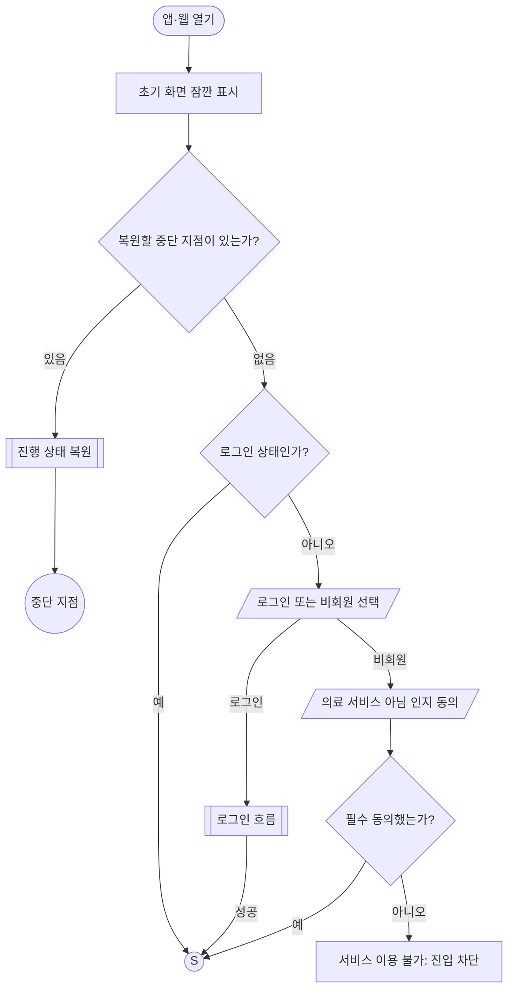
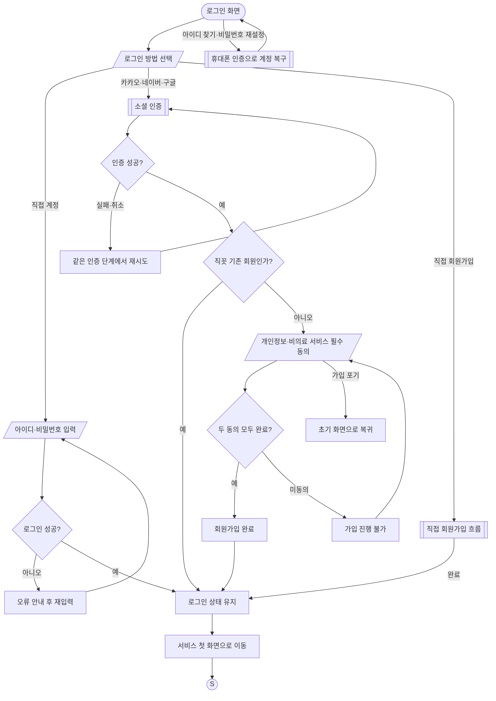
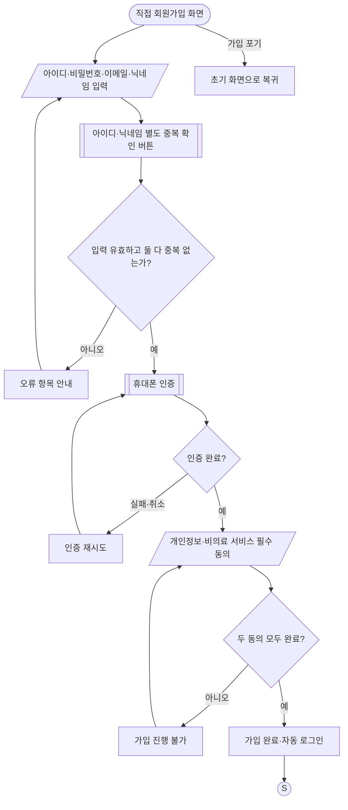
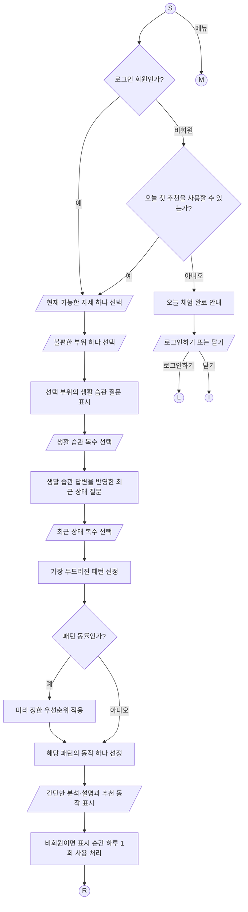
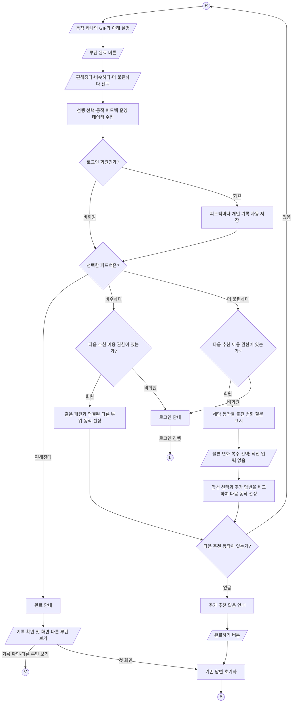
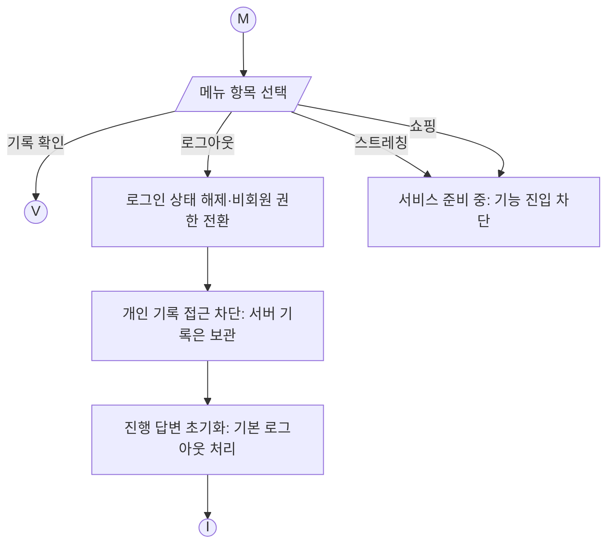
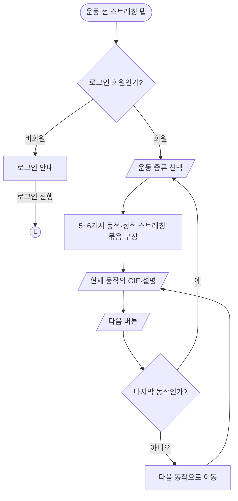
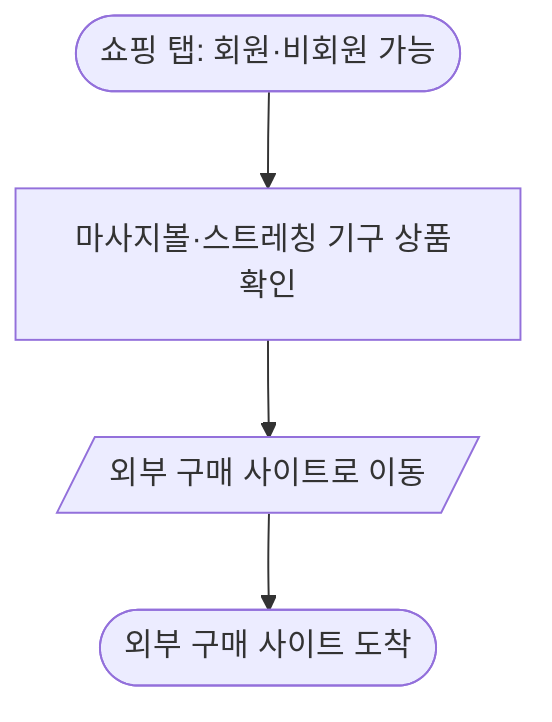
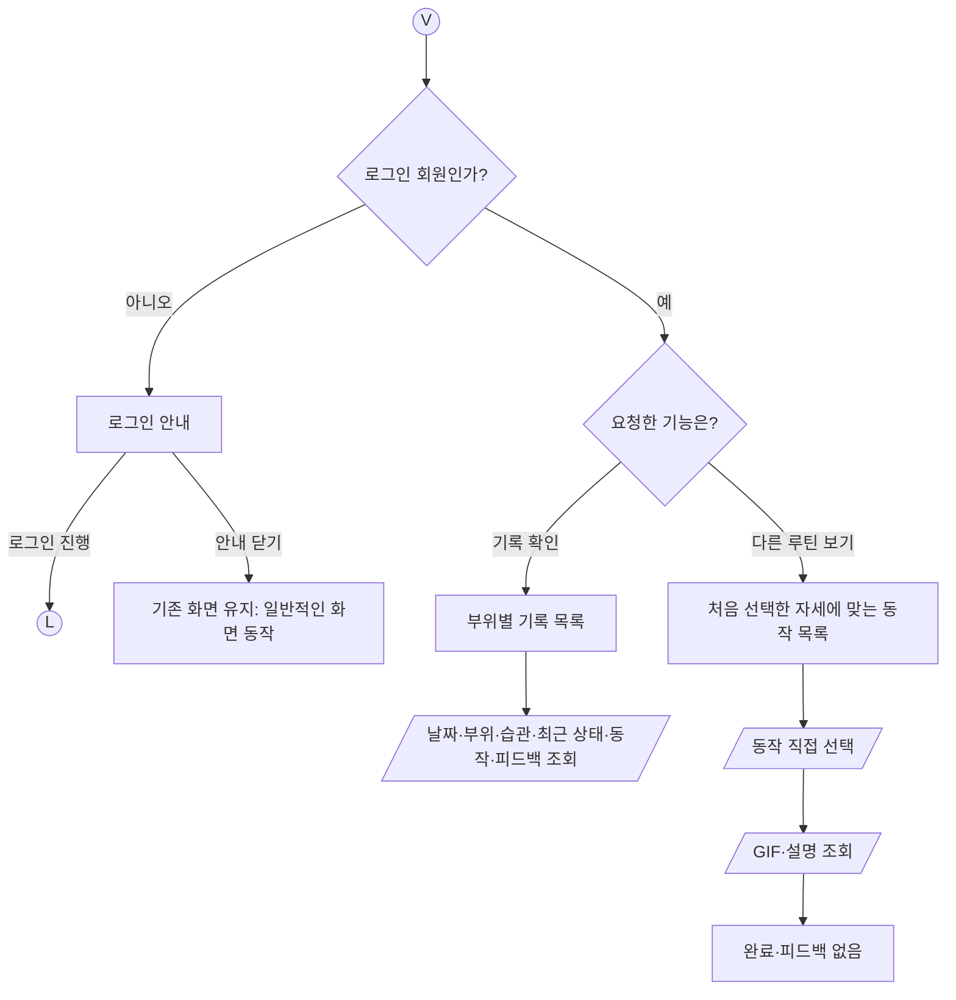
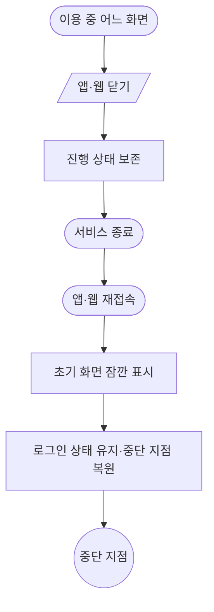

# 직꼿 서비스 플로우 차트 — 서비스 흐름 정리본

기준일: 2026-10-07. 본 문서는 이번 대화에서 확정된 화면 이동·이용 권한·피드백 분기·종료·재접속 흐름을 연결한 정리본이다. 구체적인 질문·추천 규칙·동작 콘텐츠를 확정한 문서가 아니다. 부위·생활 습관·최근 상태·패턴·추천 동작의 연결은 서비스 핵심 콘텐츠로서 별도 시간을 들여 설계하며, 현재 단계에서는 보류한다. 간단한 문답으로 연결 기준을 확정하거나 임의로 채우지 않는다.

## 1. 설계 기준

- 최종 서비스 전체를 대상으로 설계한다. 결제는 추후 도입하며 현재 회원 기능도 모두 무료다.
- 비회원은 하루 한 번 추천 동작을 체험하고 피드백을 제출한다. 기록 저장·조회, 다음 추천, 동작 목록 조회는 회원 전용이다.
- 비회원 하루 한도는 문진 전에 확인한다. 한도 도달 화면은 ‘오늘 체험 완료’와 ‘로그인하기 / 닫기’를 제공하며, ‘닫기’는 초기 화면으로 돌아간다.
- 로그인 회원의 추천 횟수에는 현재 제한을 두지 않는다.
- 회원 전용 기능은 비회원에게도 동일하게 표시하되, 사용하려고 하면 로그인을 안내한다.
- 비회원 이용 중 로그인하면 진행을 승계하지 않고 서비스 첫 화면에서 새로 시작한다.
- 비회원 체험 운영 데이터는 로그인 후 회원의 개인 기록으로 옮기지 않는다.
- 로그아웃하면 비회원 권한으로 전환된다. 회원 기록은 서버에 보관되지만 로그아웃 상태에서는 개인 기록을 조회할 수 없다. 해당 계정으로 다시 로그인하면 그 계정의 기록을 조회할 수 있다.
- 비회원이 의료 서비스가 아님 인지 동의를 거절하면 서비스 자체에 진입할 수 없다.
- 앱·웹을 닫으면 종료한다. 재접속하면 로그인 상태를 유지하고 중단 지점을 복원한다. 명시적으로 ‘첫 화면 돌아가기’를 선택한 경우에는 입력 답변을 초기화한다.
- 현재 가능한 자세와 불편한 부위는 각각 하나만 선택한다. 부위의 좌우 구분은 없다.
- 현재 가능한 자세의 선택지는 ‘앉아서만 할 수 있음’, ‘서서 할 수 있음’, ‘누워서 할 수 있음’ 세 가지로 확정한다.
- 생활 습관과 최근 상태는 복수 선택이다. ‘해당 없음’과 ‘잘 모르겠음’, 직접 입력란은 두지 않는다.
- 생활 습관 질문은 선택한 불편 부위별로 같은 질문 묶음을 제공한다. 최근 상태 질문은 앞선 생활 습관 답변을 반영하여 달라진다.
- 가장 두드러진 패턴에 맞는 동작 하나를 추천한다. 동률이면 미리 정한 우선순위를 적용한다.
- 선택한 자세로 수행할 수 없는 추천 조합은 설계에서 제외한다. 해당 상황의 대체 추천·자세 재선택 분기는 만들지 않는다. 구체적인 제외·연결 규칙은 콘텐츠 설계에서 마련한다.
- 통증 추천의 루틴 하나는 동작 하나다. GIF와 아래 설명으로 제공하며 타이머와 다음 동작 버튼은 없다. 출시 후 운동 전 스트레칭의 여러 동작 묶음은 별도 방식으로 구성한다.
- 비회원도 중단한 체험을 이어서 볼 수 있으며, 같은 추천 동작을 복원하는 것은 추가 추천 사용으로 세지 않는다.
- 서비스 첫 화면의 메뉴는 기록 확인, 로그아웃, 스트레칭, 쇼핑으로 구성한다. 현재 스트레칭·쇼핑은 탭만 제공하며 두 기능의 이용은 막고 ‘서비스 준비 중’ 안내를 표시한다.
- 출시 후 운동 전 스트레칭은 회원 전용이다. 운동 종류만 선택하면 5~6가지 동적·정적 스트레칭을 조합한 묶음을 제공하며, 각 동작은 GIF·설명으로 표시하고 ‘다음’ 버튼으로 진행한다.
- 운동 전 스트레칭은 조회 기능만 제공하며 개인 완료 기록·피드백을 받지 않는다. 마지막 동작을 마치면 운동 종류 선택 화면으로 돌아간다.
- 출시 후 쇼핑은 비회원도 가능하다. 마사지볼·스트레칭 기구 등 상품을 확인한 뒤 외부 구매 사이트로 이동한다.

## 2. 기호와 연결점

| 표현 | 의미 |
|---|---|
| 둥근 시작·끝 도형 | 시작 또는 종료 |
| 직사각형 | 화면 표시·시스템 처리 |
| 마름모 | 조건 판단 |
| 평행사변형 | 사용자 입력·선택 또는 결과 출력 |
| 양옆에 선이 있는 직사각형 | 다른 차트에서 상세히 설명하는 하위 흐름 |
| 원형 연결점 | 다른 차트의 같은 이름 연결점으로 이동 |
| ‘미정’ 표기 | 확인이 필요한 분기 또는 콘텐츠 |

| 연결점 | 목적지 |
|---|---|
| S | 서비스 첫 화면. 문진 전 이용 한도 확인, 가능한 자세 선택, 메뉴 접근 |
| R | 추천 동작의 GIF·설명 화면 |
| L | 로그인 흐름. 비회원 전환 로그인 성공 후에는 답변 초기화 후 S |
| V | 회원 전용 기록·동작 목록 조회 흐름 |
| M | 서비스 메뉴. 기록 확인·로그아웃·스트레칭·쇼핑 |
| I | 초기 화면. 잠깐 표시한 뒤 로그인·비회원 선택으로 연결 |
| E | 앱·웹 닫기와 재접속 처리 |

## 3. 첫 진입·로그인·비회원 진입

중단 지점 복원은 선택·문진·추천·조회 등 진행 중이던 화면으로 연결한다. 복원 여부에 따라 로그인 상태가 해제되는 것은 아니다. 이미 완료한 흐름을 명시적으로 새로 시작하면 이전 답변은 초기화된다.

### 로그인 상세

비회원이 회원 전용 기능에서 로그인한 경우, 성공 후 기존 답변을 초기화하고 S로 이동한다. 요청했던 기록·목록·다음 추천으로 자동 복귀하지 않는다. 비회원 체험 운영 데이터는 회원 개인 기록으로 옮기지 않는다. 기존 회원은 서버에 보관된 자신의 과거 기록을 로그인 상태에서 조회할 수 있다.

### 직접 회원가입 상세

회원가입 입력·인증·약관의 내부 배치는 일반적인 서비스 흐름에 따른 기본 구성이다. 비밀번호·아이디 형식 등 세부 유효성 기준, 인증 사업자·수단, 소셜 계정과 직접 계정의 중복 연결 정책, 약관 문구는 미정이다. 이메일은 로그인 수단이 아닌 가입 정보다.

## 4. 서비스 첫 화면·문진·첫 추천

현재 가능한 자세는 아래 세 가지 중 하나를 선택한다.

| 선택지 | 선택 방식 |
|---|---|
| 앉아서만 할 수 있음 | 단일 선택 |
| 서서 할 수 있음 | 단일 선택 |
| 누워서 할 수 있음 | 단일 선택 |

아래 차트는 문진의 화면 순서와 추천 처리의 역할을 나타낸다. 실제 불편 부위 선택지, 질문, 패턴 판별 기준과 추천 동작의 연결은 추후 콘텐츠 설계에서 마련한다.

질문과 동작의 연결표는 수행 가능한 자세에 맞는 조합으로 구성한다. 자세 불일치에 대한 별도 실패 분기를 두지 않는다. 생활 습관·최근 상태는 항목 선택 후 다음 단계로 진행하며, 미선택 입력에 대한 안내는 일반적인 입력 검증으로 처리한다.

비회원 한도는 문진 전에 확인한다. 한도 도달 시 ‘오늘 체험 완료’와 ‘로그인하기 / 닫기’를 제공한다. ‘닫기’는 앱·웹을 닫는 것이 아니라 초기 화면으로 돌아가는 동작이다. 동일한 체험의 중단 지점 복원은 새 추천 사용으로 계산하지 않는다. 일일 한도를 판단하는 비회원 식별 방법과 날짜 변경 기준은 구현 단계에서 정해야 한다.

## 5. 동작 수행·피드백·다음 추천

‘다음 추천’은 피드백 기반 재추천이다. ‘다른 루틴 보기’는 동작 목록을 직접 조회하는 경로다. 목록 조회에는 루틴 완료와 피드백을 붙이지 않는다.

비회원도 회원과 같은 피드백·완료 화면을 본다. ‘편해졌다’ 완료 화면의 기록 확인·동작 목록 조회를 누르면 로그인 안내를 표시한다. ‘비슷하다’ 또는 ‘더 불편하다’로 다음 추천 경로에 진입하면 로그인 안내를 표시한다. 로그인 후에는 기존 진행을 승계하지 않고 서비스 첫 화면에서 새로 시작한다. 로그인 안내를 닫는 동작은 기존 화면을 유지하는 일반적인 화면 처리로 구성한다.

‘더 불편하다’ 응답에 대한 질문은 동작별로 준비한 선택지를 사용한다. 어떤 변화가 어느 다음 동작으로 연결되는지, 같은 동작을 다시 추천할 수 있는지 등 상세 연결 기준은 미정이다. 위 차트는 흐름을 나타내며, 신체 상태나 원인을 확정한 것이 아니다.

## 6. 서비스 메뉴·기록·동작 목록 조회

### 서비스 첫 화면의 메뉴

현재 두 탭은 ‘서비스 준비 중’ 안내까지만 연결하며, 아래 출시 후 흐름에는 진입시키지 않는다. 준비 중 안내를 닫으면 기존 화면을 유지하는 일반적인 화면 처리로 구성한다. 출시 후 스트레칭은 회원 전용이고 쇼핑은 비회원도 이용할 수 있다. 운동 전 스트레칭과 기존 추천 후 동작 목록 조회는 서로 다른 경로다. 로그아웃하면 비회원 권한으로 전환되어 개인 기록 접근이 차단된다. 서버의 회원 기록은 삭제하지 않는다. 진행 답변 초기화 후 초기 화면으로 돌아가는 것은 사용자가 허용한 일반적인 기본 화면 처리로 구성한다.

### 출시 후 계획: 운동 전 스트레칭

운동 전 스트레칭은 운동 종류만 선택하며 통증 추천 문진을 사용하지 않는다. GIF·설명을 순서대로 보는 기능만 제공하고 개인 완료 기록·피드백은 받지 않는다. 마지막 동작을 마치면 운동 종류 선택 화면으로 돌아간다. 차트에서는 기존 ‘다음’ 버튼을 마지막 동작의 종료에도 사용하는 기본 화면 구성을 적용한다. 운동 종류의 실제 선택지, 운동별 5~6가지 조합, 동작 순서는 콘텐츠로 마련한다. 타이머나 다른 제어 기능을 추가로 확정하지 않는다.

### 출시 후 계획: 쇼핑

상품 확인 화면의 내부 목록·상세 구성과 대상 상품·외부 구매 사이트는 콘텐츠·화면 설계에서 마련한다. 직꼿 안의 장바구니·주문·결제는 이번 확정 흐름에 포함하지 않는다.

### 기존 기록·추천 후 동작 목록 조회

기록 메뉴는 서비스 첫 화면과 ‘편해졌다’ 완료 화면에서 진입한다. 기록은 부위별로 묶으며, 날짜·선택 부위·습관·최근 상태·추천 동작·수행 후 피드백을 모두 제공한다. 목록의 정렬·상세 화면 배치와 조회 화면에서의 뒤로 가기는 일반적인 화면 흐름으로 구성한다.

## 7. 앱·웹 닫기·재접속

진행 상태 보존은 다음 접속 때 이어가기 위한 상태 관리다. 회원의 개인 수행 기록과 비회원 피드백 운영 데이터는 별도 목적의 데이터다. 회원 기록은 피드백 제출마다 이미 저장되므로, 전체 이용 종료를 기다리지 않는다. 비회원에게 개인 기록 저장·조회 기능은 제공하지 않는다.

일반적인 통신·저장·인증 오류에는 오류를 안내하고 현재 단계에서 재시도하도록 구성한다. 미제출 입력은 가능한 범위에서 유지한다. 피드백 저장 실패·중복 제출 시의 세부 표시와 저장 복구 규칙은 구현 명세에서 정한다.

## 8. 회원·비회원 권한과 수집 정보

| 기능 | 비회원 | 로그인 회원 |
|---|---|---|
| 첫 추천 | 하루 1회 | 횟수 제한 없음 |
| 동작 GIF·설명 | 추천된 동작 조회 | 추천된 동작 조회 |
| 루틴 완료·피드백 | 가능 | 가능 |
| 다음 추천 | 로그인 안내 | 가능 |
| 동작 목록 직접 조회 | 로그인 안내 | 가능 |
| 개인 기록 저장·조회 | 로그인 안내. 개인 기록 제공 없음 | 피드백마다 저장·부위별 조회 |
| 스트레칭 탭: 현재 | 서비스 준비 중 | 서비스 준비 중 |
| 쇼핑 탭: 현재 | 서비스 준비 중 | 서비스 준비 중 |
| 운동 전 스트레칭: 출시 후 | 로그인 안내 | 운동 종류 선택 후 5~6가지 순차 조회. 기록·피드백 없음 |
| 쇼핑: 출시 후 | 상품 확인·외부 구매 사이트 이동 | 상품 확인·외부 구매 사이트 이동 |
| 중단 지점 복원 | 가능 | 가능 |
| 의료 서비스 아님 인지 동의 | 진입 전 필수 | 가입 시 필수 |
| 개인정보 동의 | 현재 확정된 비회원 동의 항목에는 없음 | 가입 시 필수 |
| 결제 | 현재 없음 | 현재 없음 |

비회원 운영 데이터 항목: 날짜, 가능한 자세, 불편 부위, 생활 습관, 최근 상태, 추천 동작, 수행 후 피드백. 어떤 식별 정보와 결합하는지, 저장 범위·기간·동의 문구는 아직 정하지 않았다.

## 9. 남은 결정 사항

### 현재 범위와 보류 과제

주요 화면의 연결·권한·종료·재접속 흐름을 정리했다. 가능한 자세의 세 가지 선택지도 확정했다. 핵심 콘텐츠인 실제 불편 부위 선택지, 생활 습관·최근 상태 질문, 패턴 판별과 추천 동작 연결은 별도 설계 과제로 보류한다. 본 정리본의 추천 처리 상자는 역할만 정의하며 실행 가능한 추천 규칙을 의미하지 않는다. 향후 콘텐츠 설계를 다시 시작할 때 충분한 시간을 들여 검토한다. 확정된 화면 연결 외의 새 기능이나 추가 분기를 만들 때에는 사용자에게 확인한다.

### 콘텐츠·추천 규칙으로 별도 마련할 사항

- 불편 부위의 실제 선택지. 가능한 자세의 세 가지 선택지는 확정됨.
- 부위별 생활 습관 질문·선택지.
- 생활 습관 답변별 최근 상태 질문·선택지.
- 패턴 판별 기준, 동률 우선순위표.
- 자세·패턴·동작 연결표와 수행 불가능한 조합을 제외하는 방식.
- 각 동작의 GIF·설명.
- ‘비슷하다’ 응답에 대한 관련 부위·다음 동작 연결표.
- 동작별 불편 변화 질문과 재추천 연결표.
- 운영 데이터 검토 방법과 동의·보관 정책.
- 운동 종류 선택지, 운동별 5~6가지 동적·정적 스트레칭 묶음과 순서.
- 쇼핑 상품 목록·상세 정보·외부 구매 사이트 연결.

### 구현 단계에서 정할 일반 절차

- 입력 형식·유효성 기준, 휴대폰 인증 수단.
- 계정 복구, 소셜·직접 계정 중복 연결 정책.
- 비회원 일일 한도 식별·날짜 변경 기준.
- 진행 상태 복원과 인증·통신·저장 오류 처리.

## 10. 확인된 변경 사항

- 직접 계정의 로그인 수단은 이메일에서 아이디로 변경되었다. 이메일은 가입 정보로 유지한다.
- 다른 루틴 경로가 두 가지로 나뉜다: 피드백 기반 ‘다음 추천’과 완료 후 ‘동작 목록 조회’.
- 동작 목록 조회는 추천 수행 흐름과 달리 완료·피드백이 없다.
- 비회원도 피드백을 제출하지만 개인 기록 기능은 없다.
- 비회원이 로그인하면 이전 진행으로 돌아가지 않고 새 문진을 시작한다.
- 기록은 이용 단위가 아닌 부위별로 묶어서 조회한다.
- 자세로 수행할 수 없는 조합은 설계에서 제외한다. 런타임 대체 추천 분기를 만들지 않는다.
- 비회원 한도 도달 화면은 ‘오늘 체험 완료’와 ‘로그인하기 / 닫기’로 확정되었다.
- 비회원도 동일한 피드백·완료 화면을 제공받고, 회원 전용 기능에서는 로그인 안내를 받는다.
- 로그인 회원은 현재 추천 횟수 제한 없이 이용한다.
- 하루 체험 한도는 문진 전에 확인하고, ‘닫기’는 초기 화면으로 연결한다.
- 서비스 메뉴는 기록 확인·로그아웃·운동 전 스트레칭·제품 확인 쇼핑으로 확정되었다. 새 메뉴의 내부 흐름은 질문으로 채운다.
- 현재 스트레칭·쇼핑 탭은 ‘서비스 준비 중’으로 차단한다. 출시 후 스트레칭은 회원 전용, 쇼핑은 비회원도 가능하다.
- 운동 전 스트레칭은 운동 종류 선택 후 5~6가지 동작을 GIF·설명과 ‘다음’ 버튼으로 순서대로 제공한다.
- 쇼핑은 상품 확인 후 외부 구매 사이트로 연결한다.
- 운동 전 스트레칭은 조회만 제공하고 기록·피드백을 받지 않으며, 마지막 동작 후 운동 종류 선택으로 돌아간다.
- 로그아웃은 비회원 권한 전환이며 서버의 회원 기록 삭제가 아니다. 로그아웃 상태에서는 회원 기록을 조회할 수 없다.
- 비회원 동의 거절은 서비스 진입 차단으로 확정되었다.
- 로그인 전 비회원 체험 운영 데이터는 회원 개인 기록으로 옮기지 않는다.
- 가능한 자세의 세 가지 선택지를 확정했다. 부위·생활 습관·최근 상태·패턴·추천 동작의 연결은 중요 콘텐츠 설계 과제로 별도 보류한다.
